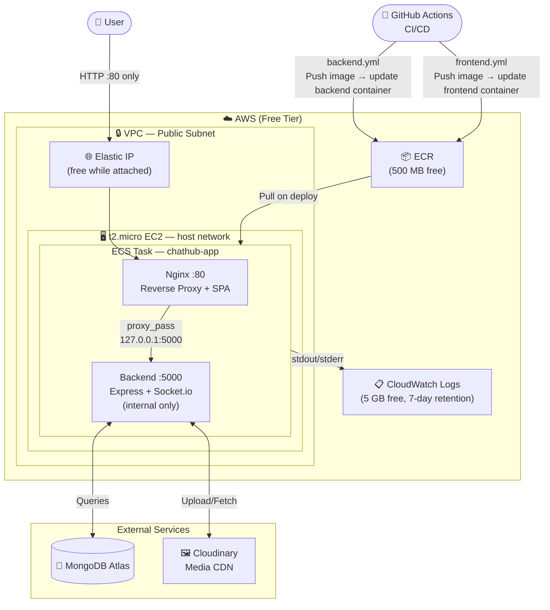
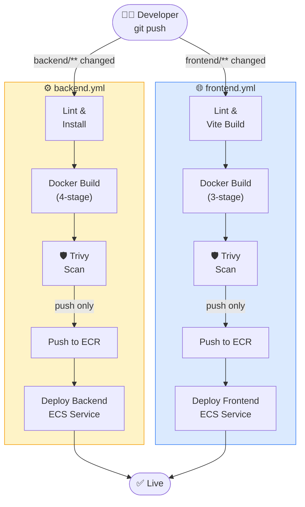
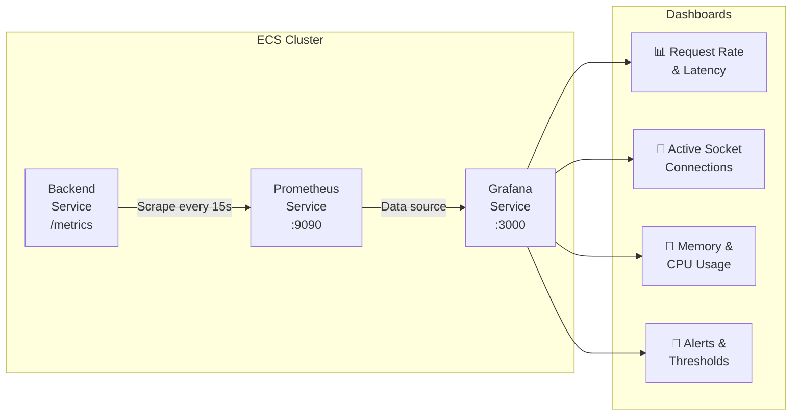

<div align="center">

# 💬 ChatHub

### Real-Time Chat Application — Full Stack & Full DevOps

*MERN · Socket.io · Docker · Terraform · AWS ECS · GitHub Actions · Prometheus · Grafana*

<br/>

[](https://github.com/zainjafri4/ChatHub-MERN-DevOps/actions/workflows/backend.yml)
[](https://github.com/zainjafri4/ChatHub-MERN-DevOps/actions/workflows/frontend.yml)
[](https://www.terraform.io/)
[](https://aws.amazon.com/ecs/)
[](https://www.docker.com/)
[](https://grafana.com/)

<br/>

[](https://nodejs.org/)
[](https://react.dev/)
[](https://mongodb.com/)
[](https://socket.io/)
[](https://tailwindcss.com/)

</div>

---

## Overview

ChatHub is a **production-grade real-time messaging application** built to demonstrate an end-to-end DevOps workflow, from writing the application to containerizing, provisioning cloud infrastructure, setting up CI/CD, and observing it in production.

> Built as a **DevOps Engineer portfolio project** covering the complete software delivery lifecycle.

```
Code → Docker → ECR → ECS (EC2) → ALB → Users
         ↑                              ↑
   GitHub Actions CI/CD         Prometheus + Grafana
         ↑
   Terraform (AWS Infra)
```

---

## Application Features

<table>
<tr>
<td>

**💬 Messaging**
- Real-time 1-to-1 direct messages
- Group chats with admin controls
- Typing indicators
- Read receipts (sent / delivered / read)

</td>
<td>

**📨 Message Actions**
- Edit & delete (with time window)
- Reply / quote messages
- Emoji reactions
- Pin important messages
- Link preview cards

</td>
</tr>
<tr>
<td>

**👥 Groups**
- Public groups (discover & join)
- Private groups with invite links
- Admin role management
- Per-group notification settings

</td>
<td>

**🔐 Security**
- JWT in `httpOnly` cookies
- Refresh token rotation
- bcrypt (12 rounds)
- Rate limiting per endpoint
- Helmet.js HTTP headers

</td>
</tr>
<tr>
<td>

**📁 Media**
- Image, video, audio, document sharing
- Avatar uploads
- File compression before upload
- CDN-backed delivery

</td>
<td>

**🎨 UI/UX**
- Dark / Light / System theme
- Fully responsive layout
- Infinite scroll message history
- Animated transitions
- Empty states with illustrations

</td>
</tr>
</table>

---

## 🏗️ Architecture

### Cloud Infrastructure



---

### CI/CD Pipeline



> Both pipelines are **fully independent and run in parallel** when a full-stack push touches both `backend/` and `frontend/`.
> `main` → **production** · `develop` → **staging** · Pull Requests → CI only

---

### Monitoring Stack



---

## 🛠️ Tech Stack

### Application Layer

| | Technology | Version | Purpose |
|:---:|---|:---:|---|
|  | React | 18 | Frontend SPA |
|  | Vite | 5 | Build tool & dev server |
|  | TailwindCSS | 3 | Utility-first styling |
|  | Zustand | 4 | Lightweight global state |
|  | Node.js | 18 | Backend runtime |
|  | Express | 4 | REST API framework |
|  | Socket.io | 4 | WebSocket real-time layer |
|  | MongoDB | Atlas | Document database |
|  | JWT + bcrypt | — | Authentication & password hashing |

### DevOps Layer

| | Technology | Purpose |
|:---:|---|---|
|  | Docker | Multi-stage container builds |
|  | Terraform | AWS infrastructure as code |
|  | GitHub Actions | CI/CD automation |
|  | AWS ECR | Private Docker image registry |
|  | AWS ECS (EC2) | Container orchestration |
|  | AWS ALB | Layer 7 load balancer |
|  | AWS VPC | Network isolation |
|  | Prometheus | Metrics collection & alerting |
|  | Grafana | Metrics dashboards & visualization |
|  | Nginx | Frontend static file server (in Docker) |

---

## ☁️ Infrastructure (Terraform)

All AWS resources are defined as code — zero manual console configuration.

```
infrastructure/
└── terraform/
    ├── modules/
    │   ├── networking/       # VPC · subnets · IGW · NAT Gateway · route tables
    │   ├── ecr/              # ECR repositories (backend + frontend)
    │   ├── ecs/              # Cluster · task definitions · services · auto-scaling
    │   ├── alb/              # ALB · target groups · listener rules (path-based routing)
    │   ├── iam/              # Task execution role · EC2 instance profile · OIDC role
    │   ├── monitoring/       # Prometheus + Grafana ECS services · EBS volumes
    │   └── security-groups/  # ALB SG · ECS instance SG · inbound/outbound rules
    ├── environments/
    │   ├── staging/          # Smaller instance types, single AZ
    │   └── production/       # Multi-AZ, auto-scaling, larger instances
    └── backend.tf            # S3 remote state + DynamoDB state locking
```

### Key Design Decisions

| Decision | Why |
|---|---|
| **ECS EC2 launch type** | Instance-level control, cost efficiency at sustained load, SSH access for debugging |
| **Private subnets for ECS** | Containers unreachable from internet; only ALB sits in public subnets |
| **NAT Gateway** | Allows private containers to reach ECR, MongoDB Atlas, and Cloudinary outbound |
| **S3 remote state + DynamoDB lock** | Safe concurrent Terraform runs across team members |
| **ALB path-based routing** | `/api/*` and `/socket.io/*` → backend · `/*` → frontend |
| **Prometheus + Grafana on ECS** | Self-hosted monitoring co-located with app, no extra managed service cost |

### Apply Infrastructure

```bash
cd infrastructure/terraform/environments/production

terraform init        # Connect to S3 backend
terraform plan        # Preview changes
terraform apply       # Provision AWS resources
```

---

## 🔄 CI/CD Pipeline (GitHub Actions)

### Two independent pipelines

| Workflow | File | Triggers when |
|---|---|---|
| **Backend CI/CD** | `.github/workflows/backend.yml` | `backend/**` or `backend.yml` changes |
| **Frontend CI/CD** | `.github/workflows/frontend.yml` | `frontend/**` or `frontend.yml` changes |

Push a CSS fix → only the frontend pipeline runs.
Push a bug fix to an API route → only the backend pipeline runs.
Push a full-stack feature → both pipelines run **in parallel**.

Each pipeline follows the same two-job structure:

```
ci:      lint → vite build (frontend only) → docker build → trivy scan
deploy:  ecr push → task definition update → ecs rolling deploy
```

> Pull requests trigger the `ci` job only — no deploy, no AWS access.

### Required GitHub Secrets

| Secret | Description |
|---|---|
| `AWS_ACCOUNT_ID` | AWS account ID |
| `AWS_REGION` | e.g. `ap-south-1` |
| `ECR_BACKEND_REPO` | ECR repository URI for backend |
| `ECR_FRONTEND_REPO` | ECR repository URI for frontend |
| `ECS_CLUSTER_NAME` | ECS cluster name from Terraform output |
| `ECS_SERVICE_BACKEND` | Backend ECS service name |
| `ECS_SERVICE_FRONTEND` | Frontend ECS service name |
| `MONGODB_URI` | MongoDB Atlas connection string |
| `ACCESS_TOKEN_SECRET` | JWT secret (min 64-byte random hex) |
| `REFRESH_TOKEN_SECRET` | JWT refresh secret (min 64-byte random hex) |
| `CLOUDINARY_CLOUD_NAME` | Cloudinary cloud name |
| `CLOUDINARY_API_KEY` | Cloudinary API key |
| `CLOUDINARY_API_SECRET` | Cloudinary API secret |

> **No long-lived AWS keys stored.** GitHub Actions authenticates to AWS via **OIDC** — it assumes an IAM role with a short-lived token per workflow run.

---

## 📊 Monitoring (Prometheus + Grafana)

Both Prometheus and Grafana run as ECS services within the same cluster.

**Prometheus** scrapes the `/metrics` endpoint exposed by the backend every 15 seconds, collecting:
- HTTP request rate and latency (by route and status code)
- Active WebSocket connections
- Node.js heap memory and GC statistics
- Event loop lag

**Grafana** connects to Prometheus as a data source and provides dashboards for:

| Dashboard | Panels |
|---|---|
| **Application Overview** | Req/s · Error rate · P95 latency · Active users |
| **Socket.io** | Active connections · Messages/s · Rooms |
| **Infrastructure** | CPU % · Memory % · Network I/O |
| **Alerts** | Response time > 500ms · Error rate > 1% |

Access Grafana via the ALB at `/grafana` (internal, auth-protected).

---

## 📁 Project Structure

```
ChatHub-MERN-DevOps/
│
├── 📄 README.md
│
├── 🖥️  backend/
│   ├── Dockerfile                    # Multi-stage Node.js build
│   ├── server.js                     # HTTP + Socket.io server entry
│   └── src/
│       ├── config/                   # DB, Cloudinary, socket constants
│       ├── controllers/              # auth · users · messages · groups · linkPreview
│       ├── middleware/               # auth · error · validate · upload · rateLimit
│       ├── models/                   # User · Message · Conversation · Group · PinnedMessage · RefreshToken
│       ├── routes/                   # Express route definitions
│       ├── socket/                   # Socket.io server + message/user/group handlers
│       └── utils/                   # JWT · ApiError · ApiResponse · linkPreview
│
├── 🌐 frontend/
│   ├── Dockerfile                    # Multi-stage Vite build → Nginx
│   ├── nginx.conf                    # SPA routing + API proxy
│   └── src/
│       ├── components/               # 35 components (chat · auth · group · profile · layout · common)
│       ├── hooks/                    # useSocket · useTyping · useInfiniteMessages
│       ├── pages/                    # Chat · Groups · Profile · Settings · Login · Register
│       ├── services/                 # Axios API layer (auth · users · messages · groups)
│       ├── store/                    # Zustand (authStore · chatStore · uiStore)
│       └── utils/                   # formatDate · fileUtils · validators
│
├── ☁️  infrastructure/
│   └── terraform/
│       ├── modules/                  # networking · ecr · ecs · alb · iam · monitoring · security-groups
│       └── environments/
│           ├── staging/
│           └── production/
│
└── ⚙️  .github/
    └── workflows/
        ├── backend.yml               # Backend CI/CD — triggers on backend/** changes only
        └── frontend.yml              # Frontend CI/CD — triggers on frontend/** changes only
```

---

## 🚀 Local Development

### Prerequisites

- Node.js 18+
- MongoDB (local) or [MongoDB Atlas](https://cloud.mongodb.com) free tier
- [Cloudinary](https://cloudinary.com) free account *(for avatar and file uploads)*

> **What is Cloudinary?** It's a cloud media storage and CDN service. The app uses it to store user avatars and shared files (images, videos, documents) so they're accessible via fast CDN URLs. The free tier is sufficient for development.

### Quick Start

```bash
# Clone the repo
git clone https://github.com/zainjafri4/ChatHub-MERN-DevOps.git
cd ChatHub-MERN-DevOps

# ── Backend ───────────────────────────────────────────────
cd backend
npm install
cp .env.example .env          # Fill in your credentials (see below)
npm run dev                   # → http://localhost:5000

# ── Frontend (new terminal) ───────────────────────────────
cd frontend
npm install
cp .env.example .env          # backend URLs for local dev (already filled)
npm run dev                   # → http://localhost:5173
```

> The Vite dev server also proxies `/api` and `/socket.io` to `localhost:5000` as a fallback, but the explicit env vars in `.env` take priority.

---

## 🔑 Environment Variables

### Frontend — `frontend/.env`

Copy `frontend/.env.example` to `frontend/.env`:

```env
# Backend REST API base URL (with /api suffix)
VITE_API_URL=http://localhost:5000/api

# Socket.io server URL (no /api suffix)
VITE_SOCKET_URL=http://localhost:5000
```

> **Why `VITE_` prefix?** Vite only exposes variables prefixed with `VITE_` to the browser bundle. Anything else stays server-side only.

> **Production values** are passed as Docker build args in the GitHub Actions workflow — they get baked into the compiled bundle:
> ```
> VITE_API_URL=https://api.yourdomain.com/api
> VITE_SOCKET_URL=https://api.yourdomain.com
> ```

---

### Backend — `backend/.env`

Copy `backend/.env.example` to `backend/.env` and fill in:

```env
# ── Server ────────────────────────────────────────────────
NODE_ENV=development
PORT=5000

# ── Database ──────────────────────────────────────────────
MONGODB_URI=mongodb+srv://<user>:<pass>@cluster.mongodb.net/chathub

# ── JWT ───────────────────────────────────────────────────
# Generate: node -e "console.log(require('crypto').randomBytes(64).toString('hex'))"
ACCESS_TOKEN_SECRET=<64-byte-random-hex>
REFRESH_TOKEN_SECRET=<64-byte-random-hex>
ACCESS_TOKEN_EXPIRY=15m
REFRESH_TOKEN_EXPIRY=7d

# ── Media Storage (Cloudinary) ────────────────────────────
CLOUDINARY_CLOUD_NAME=your_cloud_name
CLOUDINARY_API_KEY=your_api_key
CLOUDINARY_API_SECRET=your_api_secret

# ── CORS ──────────────────────────────────────────────────
CLIENT_URL=http://localhost:5173

# ── Security ──────────────────────────────────────────────
BCRYPT_ROUNDS=12
```

---

## 🐳 Docker

Both services use **multi-stage builds** to produce minimal, secure production images.

### Backend — 4 stages

| Stage | Base | Purpose |
|:---:|---|---|
| `base` | `node:18-alpine` | Copy manifests, set workdir (shared cache layer) |
| `dependencies` | `base` | `npm ci` — all deps including devDependencies |
| `prod-deps` | `base` | `npm ci --omit=dev` — production deps only |
| `runner` | `node:18-alpine` | Copies `prod-deps` + source · non-root user · ~180MB |

### Frontend — 3 stages

| Stage | Base | Purpose |
|:---:|---|---|
| `deps` | `node:18-alpine` | `npm ci` — install all dependencies |
| `builder` | `node:18-alpine` | `npm run build` — Vite compiles to `/dist` |
| `runner` | `nginx:1.25-alpine` | Copies `/dist` only · no Node.js · non-root · ~25MB |

> The final frontend image ships **zero Node.js, zero source code, zero node_modules** — only the compiled static bundle served by Nginx.

### Build & run locally

```bash
# Build
docker build -t chathub-backend  ./backend
docker build -t chathub-frontend ./frontend

# Run backend (inject env at runtime — never bake secrets into image)
docker run -p 5000:5000 --env-file backend/.env chathub-backend

# Run frontend
docker run -p 80:80 chathub-frontend
```

---

## 🔐 Security

| Area | Implementation |
|---|---|
| **Token storage** | `httpOnly` + `Secure` + `SameSite=Strict` cookies — not accessible to JavaScript |
| **Token rotation** | Refresh tokens are single-use; new token issued on every refresh |
| **Password hashing** | bcrypt, 12 salt rounds (~300ms intentional slowness against brute force) |
| **Rate limiting** | Auth 10/15min · Messages 30/min · Uploads 10/min |
| **HTTP security headers** | Helmet.js — CSP, HSTS, X-Frame-Options, X-Content-Type-Options |
| **Input validation** | `express-validator` on all endpoints + Mongoose schema validation |
| **Network isolation** | ECS containers in private subnets; ALB is the only internet-facing resource |
| **IAM least privilege** | Task execution role scoped to ECR pull + log delivery only |
| **No stored AWS keys** | GitHub Actions uses OIDC to assume IAM role per workflow run |

---

<div align="center">

Made with ❤️ by **[Zain Raza Jafri](https://github.com/zainjafri4)**

[](https://www.linkedin.com/in/zainjafri4/)
[](https://github.com/zainjafri4)

</div>
